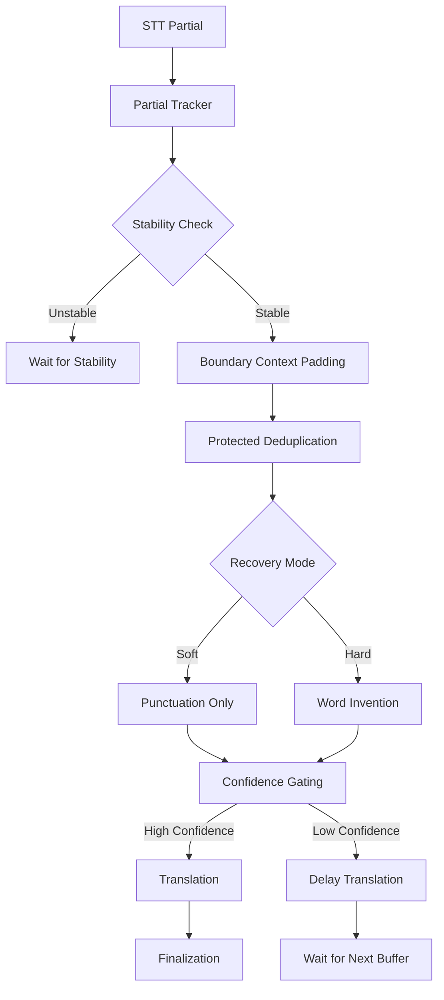

# Boundary Accuracy

Improvements Plan

## Problem Analysis

The system experiences accuracy drops at the beginning and end of segments due to:

1. **Context starvation** - Grammar/translation operate on isolated segments without surrounding context
2. **Premature finalization** - Finalization based on silence rather than token stability
3. **Over-aggressive forced recovery** - Always uses "hard mode" that invents words
4. **Deduplication removing self-correction** - Boundary tokens that provide confidence are removed
5. **Translation of low-confidence text** - Translation attempts on unstable source text

## Architecture Overview




## Implementation Plan

### 1. Boundary Context Padding System

**Files to modify:**

- `backend/soloModeHandler.js` - Add context padding in `processFinalText`
- `backend/host/adapter.js` - Add context padding in `processFinalText`
- `core/utils/contextPadding.js` - **NEW** - Context padding utility

**Implementation:**

- When finalizing a segment, include N tokens before (from previous final) and after (from next partial)
- Process grammar/translation on the padded context
- Trim padding after processing but before sending
- Default: 5 tokens before, 3 tokens after (configurable)

**Key changes:**

```javascript
// In processFinalText functions
const paddedText = addBoundaryContext(
  textToProcess,
  lastSentFinalText,  // Previous context
  latestPartialText,  // Next context
  { beforeTokens: 5, afterTokens: 3 }
);
// Process padded text
const correctedText = await grammarWorker.correctPartial(paddedText, ...);
const translatedText = await translationWorker.translatePartial(paddedText, ...);
// Trim padding before sending
const finalText = trimBoundaryContext(correctedText, paddedText, textToProcess);
```


### 2. Stability-Based Finalization

**Files to modify:**

- `core/engine/finalizationEngine.js` - Add stability tracking
- `core/engine/partialTracker.js` - Track token stability
- `backend/soloModeHandler.js` - Use stability checks
- `backend/host/adapter.js` - Use stability checks

**Implementation:**

- Track word-level changes across partials
- Calculate stability score: `stableWords / totalWords` over time window
- Finalize when stability ≥ threshold (e.g., 0.95) for duration (e.g., 500ms)
- Fallback to silence-based finalization if stability never reaches threshold

**Key changes:**

```javascript
// In finalizationEngine.js
calculateStability(partialHistory) {
  // Compare last N partials, count unchanged words
  // Return stability score 0-1
}

shouldFinalizeByStability(partialHistory) {
  const stability = this.calculateStability(partialHistory);
  const stableDuration = this.getStableDuration(partialHistory);
  return stability >= 0.95 && stableDuration >= 500;
}
```


### 3. Soft vs Hard Recovery Modes

**Files to modify:**

- `core/engine/forcedCommitEngine.js` - Add recovery mode parameter
- `backend/soloModeHandler.js` - Use soft mode by default
- `backend/host/adapter.js` - Use soft mode by default

**Implementation:**

- **Soft recovery**: Only applies punctuation, capitalization, basic grammar fixes
- **Hard recovery**: Full word invention (current behavior)
- Default to soft mode
- Hard mode only when explicitly requested or confidence is very high

**Key changes:**

```javascript
// In forcedCommitEngine.js
recoverText(text, mode = 'soft') {
  if (mode === 'soft') {
    // Only punctuation/capitalization
    return applySoftRecovery(text);
  } else {
    // Full word invention (current behavior)
    return applyHardRecovery(text);
  }
}
```


### 4. Boundary Token Protection

**Files to modify:**

- `core/utils/partialDeduplicator.js` - Add boundary protection
- `backend/soloModeHandler.js` - Pass boundary protection flags
- `backend/host/adapter.js` - Pass boundary protection flags

**Implementation:**

- Never deduplicate first N tokens (default: 2) of a segment
- Never deduplicate last N tokens (default: 2) of a segment
- Especially protect: proper nouns, numbers, quotes
- Apply protection before phrase matching

**Key changes:**

```javascript
// In partialDeduplicator.js
export function deduplicatePartialText({
  partialText,
  lastFinalText,
  // ... existing params
  protectBoundaryTokens = true,
  boundaryTokenCount = 2
}) {
  // Extract words
  const partialWords = extractWords(partialText);
  
  // Mark boundary tokens as protected
  const protectedIndices = new Set();
  if (protectBoundaryTokens) {
    // Protect first N tokens
    for (let i = 0; i < Math.min(boundaryTokenCount, partialWords.length); i++) {
      protectedIndices.add(i);
    }
    // Protect last N tokens
    for (let i = Math.max(0, partialWords.length - boundaryTokenCount); i < partialWords.length; i++) {
      protectedIndices.add(i);
    }
  }
  
  // Skip protected tokens during deduplication
  // ... existing deduplication logic with protection check
}
```


### 5. Bilingual Confidence Gating

**Files to modify:**

- `backend/translationWorkers.js` - Add confidence checking
- `backend/translationWorkersRealtime.js` - Add confidence checking
- `backend/soloModeHandler.js` - Gate translation calls
- `backend/host/adapter.js` - Gate translation calls

**Implementation:**

- Calculate source text confidence based on:
- Stability score (from stability tracking)
- Sentence completeness
- Word count (very short = lower confidence)
- If confidence < threshold (e.g., 0.7), delay translation
- Retry after next buffer arrives
- If confidence still low after 3 retries, translate anyway (fallback)

**Key changes:**

```javascript
// In translation workers
calculateSourceConfidence(text, stabilityScore, isComplete) {
  let confidence = 0.5; // Base confidence
  
  // Boost for stability
  confidence += stabilityScore * 0.3;
  
  // Boost for completeness
  if (isComplete) confidence += 0.2;
  
  // Penalty for very short text
  if (text.length < 20) confidence -= 0.2;
  
  return Math.max(0, Math.min(1, confidence));
}

// In handlers
if (sourceConfidence < 0.7) {
  // Delay translation
  scheduleDelayedTranslation(text, sourceConfidence);
} else {
  // Translate immediately
  translateText(text);
}
```


## File Structure

### New Files

- `core/utils/contextPadding.js` - Context padding utilities
- `core/utils/stabilityTracker.js` - Stability calculation utilities

### Modified Files

- `core/engine/finalizationEngine.js` - Add stability methods
- `core/engine/forcedCommitEngine.js` - Add recovery mode
- `core/utils/partialDeduplicator.js` - Add boundary protection
- `backend/soloModeHandler.js` - Integrate all improvements
- `backend/host/adapter.js` - Integrate all improvements
- `backend/translationWorkers.js` - Add confidence gating
- `backend/translationWorkersRealtime.js` - Add confidence gating

## Configuration

Add to `core/shared/types/config.js`:

```javascript
export const BOUNDARY_ACCURACY_CONSTANTS = {
  CONTEXT_PADDING_BEFORE: 5,      // Tokens before segment
  CONTEXT_PADDING_AFTER: 3,       // Tokens after segment
  STABILITY_THRESHOLD: 0.95,      // Stability score threshold
  STABILITY_DURATION_MS: 500,     // Duration at stability threshold
  BOUNDARY_PROTECTION_TOKENS: 2,   // Protected tokens at boundaries
  TRANSLATION_CONFIDENCE_THRESHOLD: 0.7,  // Minimum confidence for translation
  RECOVERY_MODE_DEFAULT: 'soft'   // Default recovery mode
};
```


## Testing Strategy

1. **Unit tests** for each component:

- Context padding (edge cases: empty context, very short segments)
- Stability calculation (various partial histories)
- Boundary protection (protected vs unprotected deduplication)
- Confidence calculation (various text scenarios)

2. **Integration tests**:

- End-to-end boundary accuracy scenarios
- Compare accuracy before/after improvements
- Measure latency impact

3. **Real-world testing**:

- Test with actual speech samples
- Monitor accuracy metrics at boundaries
- Verify no regression in latency

## Success Metrics

- **Accuracy improvement**: 20-30% reduction in errors at boundaries
- **Translation quality**: Reduced English-in-English "translations"
- **Latency impact**: < 50ms additional latency (acceptable trade-off)
- **Stability**: No increase in crashes or edge case failures

## Migration Strategy

1. **Phase 1**: Implement context padding (highest impact, lowest risk)
2. **Phase 2**: Add stability-based finalization (moderate impact, moderate risk)
3. **Phase 3**: Implement soft recovery mode (moderate impact, low risk)
4. **Phase 4**: Add boundary protection (low impact, very low risk)